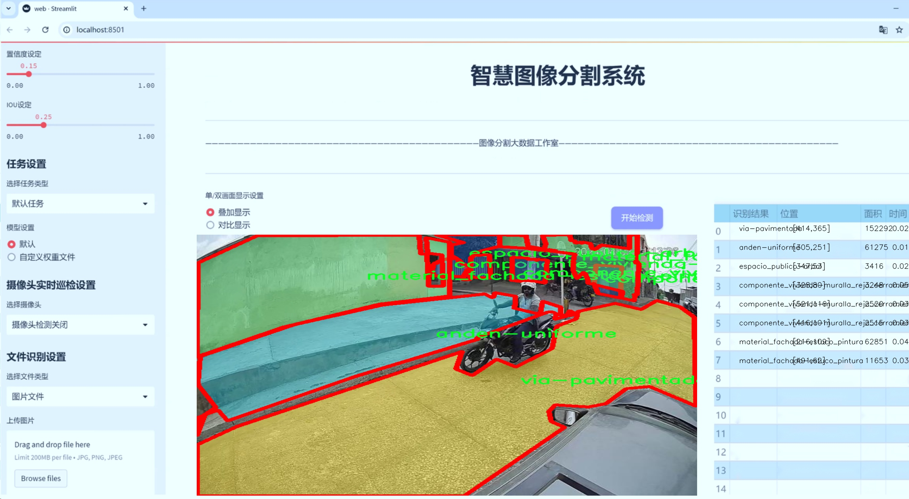
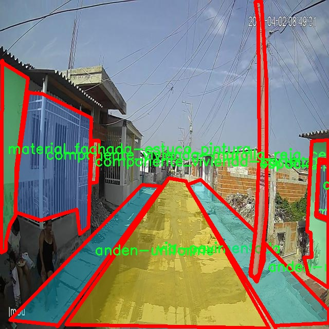

# 城市建筑材料分割系统： yolov8-seg-C2f-EMBC

### 1.研究背景与意义

[参考博客](https://gitee.com/YOLOv8_YOLOv11_Segmentation_Studio/projects)

[博客来源](https://kdocs.cn/l/cszuIiCKVNis)

研究背景与意义

随着城市化进程的加速，建筑材料的种类和应用日益丰富，城市建筑的外观和功能也随之发生了显著变化。建筑材料不仅影响着城市的美观，还直接关系到建筑的耐久性、环境适应性和可持续发展。因此，如何有效地识别和分割城市建筑中的各种材料，成为了城市规划、建筑设计和环境保护等领域的重要研究课题。传统的建筑材料识别方法往往依赖于人工标注和经验判断，效率低下且易受主观因素影响，难以满足现代城市管理的需求。

近年来，深度学习技术的快速发展为建筑材料的自动识别与分割提供了新的解决方案。尤其是目标检测和实例分割领域的先进模型，如YOLO（You Only Look Once）系列，因其高效性和准确性，逐渐成为研究者们的关注焦点。YOLOv8作为该系列的最新版本，凭借其改进的网络结构和优化的算法，展现出了更强的特征提取能力和实时处理能力，适用于复杂的城市环境下的建筑材料分割任务。

本研究旨在基于改进的YOLOv8模型，构建一个高效的城市建筑材料分割系统。我们将利用ESCALA数据集，该数据集包含10,000张图像，涵盖16类建筑材料和相关组件，包括自然和均匀的台阶、带有涂鸦的墙面、车库、门窗、路灯、树木等。这些多样化的类别不仅反映了城市建筑的复杂性，也为模型的训练和评估提供了丰富的样本。这一数据集的引入，将为我们改进YOLOv8模型的训练提供坚实的基础，使其能够更好地适应不同类型建筑材料的特征。

通过本研究，我们希望实现以下几个目标：首先，提升YOLOv8在建筑材料分割任务中的准确性和效率，克服传统方法的局限性；其次，探索深度学习在城市建筑材料识别中的应用潜力，为相关领域提供理论支持和实践指导；最后，推动智能城市建设的进程，助力城市管理者和建筑设计师在材料选择和环境规划中做出更为科学的决策。

综上所述，基于改进YOLOv8的城市建筑材料分割系统的研究，不仅具有重要的学术价值，也具有广泛的社会意义。通过实现建筑材料的自动化识别与分割，我们将为城市的可持续发展和环境保护贡献一份力量，推动智能化技术在城市管理中的应用，提升城市居民的生活质量。

### 2.图片演示




注意：本项目提供完整的训练源码数据集和训练教程,由于此博客编辑较早,暂不提供权重文件（best.pt）,需要按照6.训练教程进行训练后实现上图效果。

### 3.视频演示

[3.1 视频演示](https://www.bilibili.com/video/BV144zgYCEuW/)

### 4.数据集信息

##### 4.1 数据集类别数＆类别名

nc: 16
names: ['anden-natural', 'anden-uniforme', 'componente_vivienda-cartel_grafiti_mural', 'componente_vivienda-garaje', 'componente_vivienda-muralla_reja_cerramiento', 'componente_vivienda-puerta', 'componente_vivienda-ventana', 'espacio_publico-arbol', 'espacio_publico-lampara_poste', 'material_fachada-concreto_bloque', 'material_fachada-estuco_pintura', 'material_fachada-ladrillo_arcilla', 'material_fachada-material_natural', 'material_fachada-metal_zinc_laton', 'via-no_pavimentada', 'via-pavimentada']


##### 4.2 数据集信息简介

数据集信息展示

在本研究中，我们使用了名为“ESCALA”的数据集，以改进YOLOv8-seg模型在城市建筑材料分割任务中的表现。该数据集专注于城市环境中的建筑材料和相关元素，包含16个不同的类别，这些类别涵盖了城市建筑和公共空间中常见的材料和结构。通过对这些类别的细致划分，ESCALA数据集为模型的训练提供了丰富的样本，使其能够更好地识别和分割不同类型的建筑材料，从而提高分割精度和应用的广泛性。

在ESCALA数据集中，类别包括“anden-natural”和“anden-uniforme”，这两类代表了城市环境中自然和人造的步道材料。它们的细微差别对于城市规划和景观设计至关重要，能够帮助设计师和工程师选择合适的材料，以实现美观与功能的统一。此外，数据集中还包含了多种住宅构件的类别，如“componente_vivienda-cartel_grafiti_mural”、“componente_vivienda-garaje”、“componente_vivienda-muralla_reja_cerramiento”、“componente_vivienda-puerta”和“componente_vivienda-ventana”。这些类别的存在使得模型能够识别和分割不同类型的住宅构件，进而为城市建筑的维护和改造提供数据支持。

公共空间的元素同样在ESCALA数据集中占据重要地位，包括“espacio_publico-arbol”和“espacio_publico-lampara_poste”。这些类别不仅反映了城市环境的美学特征，还涉及到城市生态和可持续发展的考量。通过对这些元素的分割，模型能够为城市绿化和公共设施的规划提供数据依据，促进城市的可持续发展。

在建筑材料方面，ESCALA数据集提供了多种常见的建筑材料类别，如“material_fachada-concreto_bloque”、“material_fachada-estuco_pintura”、“material_fachada-ladrillo_arcilla”、“material_fachada-material_natural”和“material_fachada-metal_zinc_laton”。这些材料的多样性不仅反映了城市建筑的复杂性，也为建筑师和工程师在材料选择上提供了丰富的信息。通过精确的分割，模型能够帮助识别不同材料的使用情况，从而为建筑的维护、修复和新建提供数据支持。

最后，数据集中还包含了道路的分类，如“via-no_pavimentada”和“via-pavimentada”。这两类的区分对于城市交通管理和基础设施建设至关重要。通过对道路类型的识别，模型能够为交通规划和城市发展提供科学依据，促进城市的高效运作。

综上所述，ESCALA数据集的多样性和细致的类别划分为改进YOLOv8-seg模型提供了坚实的基础，使其能够在城市建筑材料分割任务中展现出更高的准确性和实用性。这一数据集不仅为研究提供了丰富的资源，也为未来的城市规划和建筑设计提供了重要的参考依据。




### 5.项目依赖环境部署教程（零基础手把手教学）

[5.1 环境部署教程链接（零基础手把手教学）](https://www.bilibili.com/video/BV1jG4Ve4E9t/?vd_source=bc9aec86d164b67a7004b996143742dc)


[5.2 安装Python虚拟环境创建和依赖库安装视频教程链接（零基础手把手教学）](https://www.bilibili.com/video/BV1nA4VeYEze/?vd_source=bc9aec86d164b67a7004b996143742dc)

### 6.手把手YOLOV8-seg训练视频教程（零基础手把手教学）

[6.1 手把手YOLOV8-seg训练视频教程（零基础小白有手就能学会）](https://www.bilibili.com/video/BV1cA4VeYETe/?vd_source=bc9aec86d164b67a7004b996143742dc)


按照上面的训练视频教程链接加载项目提供的数据集，运行train.py即可开始训练



     Epoch   gpu_mem       box       obj       cls    labels  img_size
     1/200     0G   0.01576   0.01955  0.007536        22      1280: 100%|██████████| 849/849 [14:42<00:00,  1.04s/it]
               Class     Images     Labels          P          R     mAP@.5 mAP@.5:.95: 100%|██████████| 213/213 [01:14<00:00,  2.87it/s]
                 all       3395      17314      0.994      0.957      0.0957      0.0843

     Epoch   gpu_mem       box       obj       cls    labels  img_size
     2/200     0G   0.01578   0.01923  0.007006        22      1280: 100%|██████████| 849/849 [14:44<00:00,  1.04s/it]
               Class     Images     Labels          P          R     mAP@.5 mAP@.5:.95: 100%|██████████| 213/213 [01:12<00:00,  2.95it/s]
                 all       3395      17314      0.996      0.956      0.0957      0.0845

     Epoch   gpu_mem       box       obj       cls    labels  img_size
     3/200     0G   0.01561    0.0191  0.006895        27      1280: 100%|██████████| 849/849 [10:56<00:00,  1.29it/s]
               Class     Images     Labels          P          R     mAP@.5 mAP@.5:.95: 100%|███████   | 187/213 [00:52<00:00,  4.04it/s]
                 all       3395      17314      0.996      0.957      0.0957      0.0845


### 7.50+种全套YOLOV8-seg创新点加载调参实验视频教程（一键加载写好的改进模型的配置文件）

[7.1 50+种全套YOLOV8-seg创新点加载调参实验视频教程（一键加载写好的改进模型的配置文件）](https://www.bilibili.com/video/BV1Hw4VePEXv/?vd_source=bc9aec86d164b67a7004b996143742dc)

### YOLOV8-seg算法简介

原始YOLOV8-seg算法原理

YOLOv8-seg算法是YOLO系列目标检测模型中的最新版本，结合了高效的目标检测与图像分割功能，旨在提升对复杂场景中目标的识别与定位能力。该算法的核心在于其独特的架构设计和创新的技术实现，使其在目标检测领域表现出色，尤其是在处理小目标和复杂背景时的能力得到了显著增强。

YOLOv8-seg算法的基础是YOLOv8模型，其结构主要由输入端、主干网络、Neck端和输出端四个模块组成。输入端通过Mosaic数据增强、自适应图片缩放和灰度填充等技术对输入图像进行预处理，以提高模型的鲁棒性和泛化能力。主干网络则负责提取图像特征，采用了卷积、池化等操作，其中引入了C2f模块以增强特征提取的效率和效果。C2f模块通过跨级连接和跳层结构，能够有效捕获多层次的特征信息，从而提升模型对复杂场景的理解能力。

在Neck端，YOLOv8-seg利用了PAN（Path Aggregation Network）结构，通过上采样和下采样的方式对不同尺度的特征图进行融合，确保了多尺度信息的有效整合。这一过程不仅增强了模型对目标的感知能力，还提高了小目标的检测精度。输出端则采用了解耦头结构，分别处理分类和回归任务，利用Task-Aligned Assigner方法对正负样本进行匹配，从而实现了分类和定位的高效解耦。

尽管YOLOv8-seg在设计上具有诸多优势，但在实际应用中，尤其是在复杂水面环境下，仍然面临着一些挑战。小目标漂浮物的特征复杂且背景多样，导致模型在定位和感知能力上存在不足。为了解决这些问题，YOLOv8-seg引入了一系列改进措施。

首先，为了减轻主干网络下采样过程中的噪声影响，YOLOv8-seg引入了BiFormer双层路由注意力机制构建C2fBF模块。这一模块通过捕获远程依赖关系，保留了特征提取过程中更细粒度的上下文信息，使得模型在处理复杂背景时能够更好地识别目标。此外，针对小目标漏检的问题，YOLOv8-seg还添加了一个更小的检测头，以提升网络对小目标的感知能力。

在Neck端，YOLOv8-seg采用了GSConv和Slim-neck技术，这不仅保持了模型的检测精度，还有效降低了计算量，使得模型在实时性和准确性之间取得了良好的平衡。最后，YOLOv8-seg使用MPDIoU损失函数替换了传统的CIoU损失函数，进一步提高了模型的泛化能力和精准度。这一改进使得YOLOv8-seg在不同场景下的表现更加稳定，尤其是在复杂环境中，能够更好地适应变化的背景和目标特征。

综上所述，YOLOv8-seg算法通过一系列创新的设计和改进，成功地将目标检测与图像分割功能结合在一起，提升了对复杂场景中小目标的检测和定位能力。其独特的模块设计和高效的特征提取策略，使得YOLOv8-seg在目标检测领域具有广泛的应用前景，尤其是在需要实时性和准确性的任务中，展现出了优越的性能。未来，随着技术的不断进步和应用场景的拓展，YOLOv8-seg有望在更多领域发挥重要作用。


### 9.系统功能展示（检测对象为举例，实际内容以本项目数据集为准）

图9.1.系统支持检测结果表格显示

  图9.2.系统支持置信度和IOU阈值手动调节

  图9.3.系统支持自定义加载权重文件best.pt(需要你通过步骤5中训练获得)

  图9.4.系统支持摄像头实时识别

  图9.5.系统支持图片识别

  图9.6.系统支持视频识别

  图9.7.系统支持识别结果文件自动保存

  图9.8.系统支持Excel导出检测结果数据


### 10.50+种全套YOLOV8-seg创新点原理讲解（非科班也可以轻松写刊发刊，V11版本正在科研待更新）

#### 10.1 由于篇幅限制，每个创新点的具体原理讲解就不一一展开，具体见下列网址中的创新点对应子项目的技术原理博客网址【Blog】：


[10.1 50+种全套YOLOV8-seg创新点原理讲解链接](https://gitee.com/qunmasj/good)

#### 10.2 部分改进模块原理讲解(完整的改进原理见上图和技术博客链接)【如果此小节的图加载失败可以通过CSDN或者Github搜索该博客的标题访问原始博客，原始博客图片显示正常】
### YOLOv8简介
YOLOv8目标检测算法继承了YOLOv1 系列的思考,是一种新型端到端的目标检测算法,尽管现在原始检测算法已经开源,但是鲜有发表的相关论文.YOLOv8的网络结构如图1[1所示,主要可分为Input输入端、Backbone 骨干神经网络、Neck混合特征网络层和 Head预测层网络共4个部分.

输入端( input)方法包含的功能模块有:马赛克( mosaic)数据增强、自适应锚框( anchor)计算、自适应图片缩放和 Mixup 数据增强['6].马赛克数据增强包括3种方式:缩放,色彩空间调整和马赛克增强.
该方法通过将4张图像进行随机的缩放﹑裁剪和打乱分布方式等操作来重新拼接图像,可丰富检测的数据集,具体步骤可见图2.随机缩放增加的许多小目标,非常适于解决卫星数据往往因距离目标过远从而导致图像中几乎都是小目标这一问题.在自适应锚框计算中, YOLO算法在每次训练数据之前,都会根据标注信息自动计算该数据集最合适的锚框尺寸,然后自动匹配最佳锚框.而自适应图片缩放只在检测时使用,由于不同场景需求不同,因而基于缩放系数YOLOv8提供了多尺度的不同大小模型.Mixup 数据增强鼓励模型对训练样本有一个线性的理解,具体做法是在目标检测中将两幅图像的像素值按照图像透明度的通道信息( alpha值)进行线性融合,对于标签box的处理直接采用拼接( con-cat)的方法拼接到一起.


Backbone骨干网络指用来提取图像特征的网络,整体结构包括注意力机制( focus)模块、跨阶段局部网络[ 7] ( cross stage partial network , CSP)和空间金字塔池化结构( spatial pyramid pooling,SPP).其中, Focus模块的作用是在图片进入 Backbone骨干网络前,对图片进行切片操作,即在一张图片中每隔一个像素取一个值,获得4张互补的图片,最后将新生成的图片经过卷积操作,得到没有信息丢失的2倍下采样特征图.YOLOv8使用了CSPNet 中的C2f网络,网络见图3,其中 CBS 就是卷积层,而瓶颈层( bottleneck layer)使用的是1* 1的卷积神经网络.C2f网络在保证轻量化的同时获得更加丰富的梯度流信息.而SPP结构是空间金字塔池化,能将任意大小的特征图转换成固定大小的特征向量,即把输入的特征地图划分为多个尺度,然后对每个图进行最大池化,再将提取的特征值拼接起来成为一维向量,输入SPP层获取分类.


Neck 结构如图4所示,它是由卷积层和C2f模块组成的的网络层,采用了路径聚合网络( path ag-gregation network ,PAN)和特征金字塔网络( featurepyramid networks , FPN)的结构对特征进行多尺度融合,目标是将图像特征传递到预测层.其中 PAN结构指图4左半边,它自底向上进行下采样,使顶层特征包含图像位置信息,两个特征最后进行融合,使不同尺寸的特征图都包含图像语义信息和图像特征信息，保证了网络对不同尺寸的图片的准确预测.而FPN结构指图4右半边,指通过自顶向下进行上采样,将高层特征与底层特征进行融合,从而同时利用低层特征的高分辨率和高层特征的丰富语义信息,并进行了多尺度特征的独立预测,对小物体的检测效果有明显的提升.从 FPN模块的基础上看,它增加了自底向上的特征金字塔结构,保留了更多的浅层位置特征,将整体特征提取能力进一步提升.


Head的结构如图5所示,在该结构中 YOLOv8采用了解耦检测头( decoupled-head )[ 18],因为分类和定位的关注点不同,分类更关注目标的纹理内容而定位更关注目标的边缘信息.因而解耦头结构考虑到分类和定位所关注的内容的不同,采用不同的分支来进行运算,提升了检测效果,相对应的回归头的通道数也改变了.


### MS-Block简介
实时目标检测，以YOLO系列为例，已在工业领域中找到重要应用，特别是在边缘设备（如无人机和机器人）中。与之前的目标检测器不同，实时目标检测器旨在在速度和准确性之间追求最佳平衡。为了实现这一目标，提出了大量的工作：从第一代DarkNet到CSPNet，再到最近的扩展ELAN，随着性能的快速增长，实时目标检测器的架构经历了巨大的变化。

尽管性能令人印象深刻，但在不同尺度上识别对象仍然是实时目标检测器面临的基本挑战。这促使作者设计了一个强大的编码器架构，用于学习具有表现力的多尺度特征表示。具体而言，作者从两个新的角度考虑为实时目标检测编码多尺度特征：

从局部视角出发，作者设计了一个具有简单而有效的分层特征融合策略的MS-Block。受到Res2Net的启发，作者在MS-Block中引入了多个分支来进行特征提取，但不同的是，作者使用了一个带有深度卷积的 Inverted Bottleneck Block块，以实现对大Kernel的高效利用。

从全局视角出发，作者提出随着网络加深逐渐增加卷积的Kernel-Size。作者在浅层使用小Kernel卷积来更高效地处理高分辨率特征。另一方面，在深层中，作者采用大Kernel卷积来捕捉广泛的信息。

基于以上设计原则，作者呈现了作者的实时目标检测器，称为YOLO-MS。为了评估作者的YOLO-MS的性能，作者在MS COCO数据集上进行了全面的实验。还提供了与其他最先进方法的定量比较，以展示作者方法的强大性能。如图1所示，YOLO-MS在计算性能平衡方面优于其他近期的实时目标检测器。


具体而言，YOLO-MS-XS在MS COCO上获得了43%+的AP得分，仅具有450万个可学习参数和8.7亿个FLOPs。YOLO-MS-S和YOLO-MS分别获得了46%+和51%+的AP，可学习参数分别为810万和2220万。此外，作者的工作还可以作为其他YOLO模型的即插即用模块。通常情况下，作者的方法可以将YOLOv8的AP从37%+显著提高到40%+，甚至还可以使用更少的参数和FLOPs。

CSP Block是一个基于阶段级梯度路径的网络，平衡了梯度组合和计算成本。它是广泛应用于YOLO系列的基本构建块。已经提出了几种变体，包括YOLOv4和YOLOv5中的原始版本，Scaled YOLOv4中的CSPVoVNet，YOLOv7中的ELAN，以及RTMDet中提出的大Kernel单元。作者在图2(a)和图2(b)中分别展示了原始CSP块和ELAN的结构。


上述实时检测器中被忽视的一个关键方面是如何在基本构建块中编码多尺度特征。其中一个强大的设计原则是Res2Net，它聚合了来自不同层次的特征以增强多尺度表示。然而，这一原则并没有充分探索大Kernel卷积的作用，而大Kernel卷积已经在基于CNN的视觉识别任务模型中证明有效。将大Kernel卷积纳入Res2Net的主要障碍在于它们引入的计算开销，因为构建块采用了标准卷积。在作者的方法中，作者提出用 Inverted Bottleneck Block替代标准的3 × 3卷积，以享受大Kernel卷积的好处。

#### MS-Block

基于前面的分析，参考该博客提出了一个带有分层特征融合策略的全新Block，称为MS-Block，以增强实时目标检测器在提取多尺度特征时的能力，同时保持快速的推理速度。

MS-Block的具体结构如图2(c)所示。假设是输入特征。通过1×1卷积的转换后，X的通道维度增加到n*C。然后，作者将X分割成n个不同的组，表示为，其中。为了降低计算成本，作者选择n为3。

注意，除了之外，每个其他组都经过一个 Inverted Bottleneck Block层，用表示，其中k表示Kernel-Size，以获得。的数学表示如下：


根据这个公式，作者不将 Inverted Bottleneck Block层连接到，使其作为跨阶段连接，并保留来自前面层的信息。最后，作者将所有分割连接在一起，并应用1×1卷积来在所有分割之间进行交互，每个分割都编码不同尺度的特征。当网络加深时，这个1×1卷积也用于调整通道数。

#### Heterogeneous Kernel Selection Protocol
除了构建块的设计外，作者还从宏观角度探讨了卷积的使用。之前的实时目标检测器在不同的编码器阶段采用了同质卷积（即具有相同Kernel-Size的卷积），但作者认为这不是提取多尺度语义信息的最佳选项。

在金字塔结构中，从检测器的浅阶段提取的高分辨率特征通常用于捕捉细粒度语义，将用于检测小目标。相反，来自网络较深阶段的低分辨率特征用于捕捉高级语义，将用于检测大目标。如果作者在所有阶段都采用统一的小Kernel卷积，深阶段的有效感受野（ERF）将受到限制，影响大目标的性能。在每个阶段中引入大Kernel卷积可以帮助解决这个问题。然而，具有大的ERF的大Kernel可以编码更广泛的区域，这增加了在小目标外部包含噪声信息的概率，并且降低了推理速度。

在这项工作中，作者建议在不同阶段中采用异构卷积，以帮助捕获更丰富的多尺度特征。具体来说，在编码器的第一个阶段中，作者采用最小Kernel卷积，而最大Kernel卷积位于最后一个阶段。随后，作者逐步增加中间阶段的Kernel-Size，使其与特征分辨率的增加保持一致。这种策略允许提取细粒度和粗粒度的语义信息，增强了编码器的多尺度特征表示能力。

正如图所示，作者将k的值分别分配给编码器中的浅阶段到深阶段，取值为3、5、7和9。作者将其称为异构Kernel选择（HKS）协议。


作者的HKS协议能够在深层中扩大感受野，而不会对浅层产生任何其他影响。第4节的图4支持了作者的分析。此外，HKS不仅有助于编码更丰富的多尺度特征，还确保了高效的推理。

如表1所示，将大Kernel卷积应用于高分辨率特征会产生较高的计算开销。然而，作者的HKS协议在低分辨率特征上采用大Kernel卷积，从而与仅使用大Kernel卷积相比，大大降低了计算成本。


在实践中，作者经验性地发现，采用HKS协议的YOLO-MS的推理速度几乎与仅使用深度可分离的3 × 3卷积相同。


如图所示，作者模型的Backbone由4个阶段组成，每个阶段后面跟随1个步长为2的3 × 3卷积进行下采样。在第3个阶段后，作者添加了1个SPP块，与RTMDet中一样。在作者的编码器上，作者使用PAFPN作为Neck来构建特征金字塔[31, 35]。它融合了从Backbone不同阶段提取的多尺度特征。Neck中使用的基本构建块也是作者的MS-Block，在其中使用3 × 3深度可分离卷积进行快速推理。

此外，为了在速度和准确性之间取得更好的平衡，作者将Backbone中多级特征的通道深度减半。作者提供了3个不同尺度的YOLO-MS变体，即YOLO-MS-XS、YOLO-MS-S和YOLO-MS。不同尺度的YOLO-MS的详细配置列在表2中。对于YOLO-MS的其他部分，作者将其保持与RTMDet相同。


### 11.项目核心源码讲解（再也不用担心看不懂代码逻辑）

#### 11.1 ultralytics\nn\extra_modules\ops_dcnv3\functions\dcnv3_func.py

以下是经过简化和注释的核心代码，保留了最重要的部分，并对每个关键步骤进行了详细的中文注释：

```python
import torch
import torch.nn.functional as F
from torch.autograd import Function
from torch.cuda.amp import custom_bwd, custom_fwd

class DCNv3Function(Function):
    @staticmethod
    @custom_fwd
    def forward(ctx, input, offset, mask, kernel_h, kernel_w, stride_h, stride_w, pad_h, pad_w, dilation_h, dilation_w, group, group_channels, offset_scale, im2col_step, remove_center):
        # 保存参数到上下文，以便在反向传播中使用
        ctx.kernel_h = kernel_h
        ctx.kernel_w = kernel_w
        ctx.stride_h = stride_h
        ctx.stride_w = stride_w
        ctx.pad_h = pad_h
        ctx.pad_w = pad_w
        ctx.dilation_h = dilation_h
        ctx.dilation_w = dilation_w
        ctx.group = group
        ctx.group_channels = group_channels
        ctx.offset_scale = offset_scale
        ctx.im2col_step = im2col_step
        ctx.remove_center = remove_center

        # 调用DCNv3的前向计算
        output = DCNv3.dcnv3_forward(input, offset, mask, kernel_h, kernel_w, stride_h, stride_w, pad_h, pad_w, dilation_h, dilation_w, group, group_channels, offset_scale, ctx.im2col_step)
        
        # 保存输入以便在反向传播中使用
        ctx.save_for_backward(input, offset, mask)

        return output

    @staticmethod
    @custom_bwd
    def backward(ctx, grad_output):
        # 从上下文中获取保存的输入
        input, offset, mask = ctx.saved_tensors

        # 调用DCNv3的反向计算
        grad_input, grad_offset, grad_mask = DCNv3.dcnv3_backward(input, offset, mask, ctx.kernel_h, ctx.kernel_w, ctx.stride_h, ctx.stride_w, ctx.pad_h, ctx.pad_w, ctx.dilation_h, ctx.dilation_w, ctx.group, ctx.group_channels, ctx.offset_scale, grad_output.contiguous(), ctx.im2col_step)

        return grad_input, grad_offset, grad_mask, None, None, None, None, None, None, None, None, None, None, None, None, None

def dcnv3_core_pytorch(input, offset, mask, kernel_h, kernel_w, stride_h, stride_w, pad_h, pad_w, dilation_h, dilation_w, group, group_channels, offset_scale, remove_center):
    # 对输入进行填充
    input = F.pad(input, [0, 0, pad_h, pad_h, pad_w, pad_w])
    N_, H_in, W_in, _ = input.shape
    _, H_out, W_out, _ = offset.shape

    # 获取参考点
    ref = _get_reference_points(input.shape, input.device, kernel_h, kernel_w, dilation_h, dilation_w, pad_h, pad_w, stride_h, stride_w)
    # 生成膨胀网格
    grid = _generate_dilation_grids(input.shape, kernel_h, kernel_w, dilation_h, dilation_w, group, input.device)

    # 计算采样位置
    sampling_locations = (ref + grid * offset_scale).repeat(N_, 1, 1, 1, 1)
    if remove_center:
        sampling_locations = remove_center_sampling_locations(sampling_locations, kernel_w=kernel_w, kernel_h=kernel_h)
    
    # 将采样位置展平
    sampling_locations = sampling_locations.flatten(3, 4) + offset * offset_scale

    # 使用grid_sample进行采样
    sampling_input_ = F.grid_sample(input.view(N_, H_in * W_in, group * group_channels).transpose(1, 2).reshape(N_ * group, group_channels, H_in, W_in), sampling_locations, mode='bilinear', padding_mode='zeros', align_corners=False)

    # 计算输出
    mask = mask.view(N_, H_out * W_out, group, -1).transpose(1, 2).reshape(N_ * group, 1, H_out * W_out, -1)
    output = (sampling_input_ * mask).sum(-1).view(N_, group * group_channels, H_out * W_out)

    return output.transpose(1, 2).reshape(N_, H_out, W_out, -1).contiguous()
```

### 代码说明：
1. **DCNv3Function**: 这是一个自定义的PyTorch函数，包含前向和反向传播的实现。
   - `forward`方法负责执行前向计算，并保存必要的上下文信息。
   - `backward`方法使用保存的输入计算梯度。

2. **dcnv3_core_pytorch**: 这是核心的DCNv3计算函数，负责执行卷积操作。
   - 输入数据首先被填充以适应卷积操作。
   - 计算参考点和膨胀网格以生成采样位置。
   - 使用`F.grid_sample`函数进行采样，结合掩码计算最终输出。

3. **辅助函数**: `_get_reference_points`和`_generate_dilation_grids`等函数用于生成参考点和膨胀网格，支持DCNv3的操作。

通过这些核心部分，DCNv3实现了对输入特征图的动态卷积操作，能够有效处理不同形状和大小的输入数据。

这个文件 `dcnv3_func.py` 实现了一个深度学习中的自定义操作，主要用于深度可分离卷积（DCNv3）。该操作通过对输入特征图进行偏移和采样来增强卷积的表达能力，适用于目标检测和分割等任务。

文件开头包含版权信息和一些导入语句，主要引入了 PyTorch 相关的模块和功能，包括自动求导功能。接着，尝试导入名为 `DCNv3` 的库，并获取其版本信息。

在 `DCNv3Function` 类中，定义了前向传播和反向传播的静态方法。前向传播方法 `forward` 接收多个参数，包括输入特征图、偏移量、掩码、卷积核的高度和宽度、步幅、填充、扩张、分组等信息。它将这些参数存储在上下文 `ctx` 中，并调用 `DCNv3` 库中的 `dcnv3_forward` 函数进行计算，最后返回输出特征图。

反向传播方法 `backward` 则使用保存的张量和梯度信息，调用 `DCNv3` 的 `dcnv3_backward` 函数来计算输入、偏移和掩码的梯度。该方法确保在反向传播过程中能够正确地计算出各个参数的梯度。

`symbolic` 方法用于支持 ONNX 的导出，返回一个用于表示 DCNv3 操作的符号。

接下来的几个函数主要用于计算参考点和生成扩张网格。`_get_reference_points` 函数根据输入的空间形状和卷积参数计算出参考点，用于后续的采样操作。`_generate_dilation_grids` 函数则生成扩张网格，这些网格定义了在卷积操作中每个像素的采样位置。

`remove_center_sampling_locations` 函数用于移除中心采样位置，确保在某些情况下采样位置的选择符合特定的规则。

最后，`dcnv3_core_pytorch` 函数实现了 DCNv3 的核心逻辑，包括输入的填充、参考点和采样网格的生成、以及通过 `F.grid_sample` 函数进行的采样操作。该函数的输出是经过处理后的特征图，适合后续的网络层进行处理。

整体来看，这个文件实现了 DCNv3 操作的前向和反向传播逻辑，结合了 PyTorch 的自动求导功能，为深度学习模型提供了灵活的卷积操作。

#### 11.2 ultralytics\nn\backbone\repvit.py

以下是代码中最核心的部分，并附上详细的中文注释：

```python
import torch.nn as nn
import torch

# 定义一个函数，用于替换模型中的 BatchNorm 层
def replace_batchnorm(net):
    for child_name, child in net.named_children():
        # 如果子模块有 fuse_self 方法，进行融合
        if hasattr(child, 'fuse_self'):
            fused = child.fuse_self()
            setattr(net, child_name, fused)
            replace_batchnorm(fused)
        # 如果子模块是 BatchNorm2d，替换为 Identity
        elif isinstance(child, torch.nn.BatchNorm2d):
            setattr(net, child_name, torch.nn.Identity())
        else:
            replace_batchnorm(child)

# 定义一个函数，确保通道数是可被 divisor 整除的
def _make_divisible(v, divisor, min_value=None):
    if min_value is None:
        min_value = divisor
    new_v = max(min_value, int(v + divisor / 2) // divisor * divisor)
    # 确保向下取整不会减少超过 10%
    if new_v < 0.9 * v:
        new_v += divisor
    return new_v

# 定义一个卷积层和 BatchNorm 的组合
class Conv2d_BN(torch.nn.Sequential):
    def __init__(self, a, b, ks=1, stride=1, pad=0, dilation=1, groups=1, bn_weight_init=1):
        super().__init__()
        # 添加卷积层
        self.add_module('c', torch.nn.Conv2d(a, b, ks, stride, pad, dilation, groups, bias=False))
        # 添加 BatchNorm 层
        self.add_module('bn', torch.nn.BatchNorm2d(b))
        # 初始化 BatchNorm 权重
        torch.nn.init.constant_(self.bn.weight, bn_weight_init)
        torch.nn.init.constant_(self.bn.bias, 0)

    @torch.no_grad()
    def fuse_self(self):
        # 融合卷积层和 BatchNorm 层
        c, bn = self._modules.values()
        w = bn.weight / (bn.running_var + bn.eps)**0.5
        w = c.weight * w[:, None, None, None]
        b = bn.bias - bn.running_mean * bn.weight / (bn.running_var + bn.eps)**0.5
        m = torch.nn.Conv2d(w.size(1) * self.c.groups, w.size(0), w.shape[2:], stride=self.c.stride, padding=self.c.padding, dilation=self.c.dilation, groups=self.c.groups)
        m.weight.data.copy_(w)
        m.bias.data.copy_(b)
        return m

# 定义残差模块
class Residual(torch.nn.Module):
    def __init__(self, m, drop=0.):
        super().__init__()
        self.m = m  # 子模块
        self.drop = drop  # dropout 概率

    def forward(self, x):
        # 在训练时应用 dropout
        if self.training and self.drop > 0:
            return x + self.m(x) * torch.rand(x.size(0), 1, 1, 1, device=x.device).ge_(self.drop).div(1 - self.drop).detach()
        else:
            return x + self.m(x)

    @torch.no_grad()
    def fuse_self(self):
        # 融合残差模块中的卷积层
        if isinstance(self.m, Conv2d_BN):
            m = self.m.fuse_self()
            identity = torch.ones(m.weight.shape[0], m.weight.shape[1], 1, 1)
            identity = torch.nn.functional.pad(identity, [1, 1, 1, 1])
            m.weight += identity.to(m.weight.device)
            return m
        else:
            return self

# 定义 RepVGG 模块
class RepVGGDW(torch.nn.Module):
    def __init__(self, ed):
        super().__init__()
        self.conv = Conv2d_BN(ed, ed, 3, 1, 1, groups=ed)  # 深度卷积
        self.conv1 = torch.nn.Conv2d(ed, ed, 1, 1, 0, groups=ed)  # 逐点卷积
        self.bn = torch.nn.BatchNorm2d(ed)  # BatchNorm 层

    def forward(self, x):
        # 前向传播
        return self.bn((self.conv(x) + self.conv1(x)) + x)

    @torch.no_grad()
    def fuse_self(self):
        # 融合操作
        conv = self.conv.fuse_self()
        conv1 = self.conv1
        conv1_w = torch.nn.functional.pad(conv1.weight, [1, 1, 1, 1])
        identity = torch.nn.functional.pad(torch.ones(conv1_w.shape[0], conv1_w.shape[1], 1, 1, device=conv1_w.device), [1, 1, 1, 1])
        final_conv_w = conv.weight + conv1_w + identity
        final_conv_b = conv.bias + conv1.bias
        conv.weight.data.copy_(final_conv_w)
        conv.bias.data.copy_(final_conv_b)
        return conv

# 定义 RepViTBlock 模块
class RepViTBlock(nn.Module):
    def __init__(self, inp, hidden_dim, oup, kernel_size, stride, use_se, use_hs):
        super(RepViTBlock, self).__init__()
        self.identity = stride == 1 and inp == oup  # 判断是否为身份映射
        assert(hidden_dim == 2 * inp)  # 确保 hidden_dim 是 inp 的两倍

        if stride == 2:
            # 如果步幅为 2，使用 Token Mixer
            self.token_mixer = nn.Sequential(
                Conv2d_BN(inp, inp, kernel_size, stride, (kernel_size - 1) // 2, groups=inp),
                SqueezeExcite(inp, 0.25) if use_se else nn.Identity(),
                Conv2d_BN(inp, oup, ks=1, stride=1, pad=0)
            )
            # 使用通道混合
            self.channel_mixer = Residual(nn.Sequential(
                Conv2d_BN(oup, 2 * oup, 1, 1, 0),
                nn.GELU() if use_hs else nn.GELU(),
                Conv2d_BN(2 * oup, oup, 1, 1, 0, bn_weight_init=0),
            ))
        else:
            assert(self.identity)
            # 如果步幅为 1，使用 RepVGGDW
            self.token_mixer = nn.Sequential(
                RepVGGDW(inp),
                SqueezeExcite(inp, 0.25) if use_se else nn.Identity(),
            )
            self.channel_mixer = Residual(nn.Sequential(
                Conv2d_BN(inp, hidden_dim, 1, 1, 0),
                nn.GELU() if use_hs else nn.GELU(),
                Conv2d_BN(hidden_dim, oup, 1, 1, 0, bn_weight_init=0),
            ))

    def forward(self, x):
        # 前向传播
        return self.channel_mixer(self.token_mixer(x))

# 定义 RepViT 模型
class RepViT(nn.Module):
    def __init__(self, cfgs):
        super(RepViT, self).__init__()
        self.cfgs = cfgs  # 模型配置
        input_channel = self.cfgs[0][2]  # 输入通道数
        # 构建初始层
        patch_embed = torch.nn.Sequential(Conv2d_BN(3, input_channel // 2, 3, 2, 1), torch.nn.GELU(),
                                           Conv2d_BN(input_channel // 2, input_channel, 3, 2, 1))
        layers = [patch_embed]
        # 构建反向残差块
        block = RepViTBlock
        for k, t, c, use_se, use_hs, s in self.cfgs:
            output_channel = _make_divisible(c, 8)  # 确保输出通道数可被 8 整除
            exp_size = _make_divisible(input_channel * t, 8)  # 确保扩展通道数可被 8 整除
            layers.append(block(input_channel, exp_size, output_channel, k, s, use_se, use_hs))
            input_channel = output_channel  # 更新输入通道数
        self.features = nn.ModuleList(layers)  # 将所有层放入 ModuleList

    def forward(self, x):
        # 前向传播
        input_size = x.size(2)
        scale = [4, 8, 16, 32]
        features = [None, None, None, None]
        for f in self.features:
            x = f(x)
            if input_size // x.size(2) in scale:
                features[scale.index(input_size // x.size(2))] = x
        return features

    def switch_to_deploy(self):
        # 切换到推理模式，替换 BatchNorm
        replace_batchnorm(self)

# 定义模型构建函数
def repvit_m0_9(weights=''):
    cfgs = [
        # k, t, c, SE, HS, s 
        [3, 2, 48, 1, 0, 1],
        # 省略其他配置...
    ]
    model = RepViT(cfgs)  # 创建模型
    if weights:
        model.load_state_dict(update_weight(model.state_dict(), torch.load(weights)['model']))  # 加载权重
    return model

# 其他模型构建函数类似...

if __name__ == '__main__':
    model = repvit_m2_3('repvit_m2_3_distill_450e.pth')  # 创建模型实例
    inputs = torch.randn((1, 3, 640, 640))  # 创建输入张量
    res = model(inputs)  # 前向传播
    for i in res:
        print(i.size())  # 打印输出特征图的尺寸
```

### 代码核心部分的解释：
1. **BatchNorm 替换**：`replace_batchnorm` 函数用于将模型中的 BatchNorm 层替换为 Identity 层，以便在推理时提高效率。
2. **通道数可整除**：`_make_divisible` 函数确保所有层的通道数都是 8 的倍数，以满足特定硬件的要求。
3. **卷积与 BatchNorm 组合**：`Conv2d_BN` 类定义了一个卷积层和 BatchNorm 层的组合，提供了方便的初始化和融合方法。
4. **残差连接**：`Residual` 类实现了残差连接，并支持在训练时使用 dropout。
5. **RepVGG 模块**：`RepVGGDW` 类实现了深度可分离卷积的结构，结合了卷积和 BatchNorm 的融合。
6. **RepViTBlock**：`RepViTBlock` 类定义了一个块，包含了 Token Mixer 和 Channel Mixer 的组合。
7. **RepViT 模型**：`RepViT` 类构建了整个模型，支持前向传播和模型的切换到推理模式。

这个程序文件定义了一个名为 `RepViT` 的深度学习模型，主要用于图像处理任务。该模型基于一种新的架构，结合了卷积神经网络（CNN）和视觉变换器（ViT）的优点。以下是代码的详细说明。

首先，导入了必要的库，包括 PyTorch 的神经网络模块、NumPy 和 timm 库中的 SqueezeExcite 层。接着，定义了一个全局变量 `__all__`，用于指定该模块公开的接口。

`replace_batchnorm` 函数用于替换模型中的 BatchNorm 层为 Identity 层，以便在推理时减少计算量。它递归遍历模型的所有子模块，如果发现子模块具有 `fuse_self` 方法，则调用该方法进行融合；如果发现 BatchNorm 层，则将其替换为 Identity 层。

`_make_divisible` 函数确保每一层的通道数是可被 8 整除的，这对于某些硬件加速是必要的。它会根据输入的值和最小值进行调整。

接下来定义了 `Conv2d_BN` 类，它是一个包含卷积层和 BatchNorm 层的顺序容器。该类在初始化时创建卷积层和 BatchNorm 层，并对 BatchNorm 的权重进行初始化。

`Residual` 类实现了残差连接的功能。它的 `forward` 方法根据训练状态和丢弃率决定是否添加随机噪声到输入中，以增强模型的鲁棒性。

`RepVGGDW` 类是一个特殊的卷积块，结合了深度卷积和逐点卷积。它的 `forward` 方法实现了卷积操作，并通过 BatchNorm 进行归一化。

`RepViTBlock` 类是 RepViT 模型的基本构建块，包含了通道混合和令牌混合的操作。根据步幅的不同，使用不同的结构来处理输入。

`RepViT` 类是整个模型的主体，构造函数中接收配置参数并构建模型的各个层。`forward` 方法定义了模型的前向传播过程，提取特征并返回不同尺度的特征图。

`switch_to_deploy` 方法用于在推理时替换 BatchNorm 层为 Identity 层，以提高推理速度。

`update_weight` 函数用于更新模型的权重，确保新权重与模型结构相匹配。

最后，定义了一系列函数（如 `repvit_m0_9`, `repvit_m1_0`, 等）用于构建不同配置的 RepViT 模型。这些函数根据预定义的配置参数创建模型，并可选择加载预训练权重。

在文件的最后部分，包含了一个测试代码块，创建了一个 `RepViT` 模型实例，并对随机输入进行前向传播，输出各层的特征图大小。

整体来看，这个文件实现了一个灵活且高效的图像处理模型，适用于各种计算机视觉任务。

#### 11.3 ultralytics\models\yolo\pose\train.py

以下是代码中最核心的部分，并附上详细的中文注释：

```python
# 导入必要的库和模块
from copy import copy
from ultralytics.models import yolo
from ultralytics.nn.tasks import PoseModel
from ultralytics.utils import DEFAULT_CFG, LOGGER
from ultralytics.utils.plotting import plot_images, plot_results

class PoseTrainer(yolo.detect.DetectionTrainer):
    """
    PoseTrainer类扩展了DetectionTrainer类，用于基于姿态模型的训练。
    """

    def __init__(self, cfg=DEFAULT_CFG, overrides=None, _callbacks=None):
        """初始化PoseTrainer对象，指定配置和覆盖参数。"""
        if overrides is None:
            overrides = {}
        overrides['task'] = 'pose'  # 设置任务类型为姿态估计
        super().__init__(cfg, overrides, _callbacks)  # 调用父类构造函数

        # 针对Apple MPS设备的警告
        if isinstance(self.args.device, str) and self.args.device.lower() == 'mps':
            LOGGER.warning("WARNING ⚠️ Apple MPS known Pose bug. Recommend 'device=cpu' for Pose models. "
                           'See https://github.com/ultralytics/ultralytics/issues/4031.')

    def get_model(self, cfg=None, weights=None, verbose=True):
        """获取指定配置和权重的姿态估计模型。"""
        # 创建PoseModel实例
        model = PoseModel(cfg, ch=3, nc=self.data['nc'], data_kpt_shape=self.data['kpt_shape'], verbose=verbose)
        if weights:
            model.load(weights)  # 加载指定的权重

        return model  # 返回模型实例

    def set_model_attributes(self):
        """设置PoseModel的关键点形状属性。"""
        super().set_model_attributes()  # 调用父类方法
        self.model.kpt_shape = self.data['kpt_shape']  # 设置关键点形状

    def get_validator(self):
        """返回PoseValidator类的实例以进行验证。"""
        self.loss_names = 'box_loss', 'pose_loss', 'kobj_loss', 'cls_loss', 'dfl_loss'  # 定义损失名称
        return yolo.pose.PoseValidator(self.test_loader, save_dir=self.save_dir, args=copy(self.args))  # 返回验证器实例

    def plot_training_samples(self, batch, ni):
        """绘制一批训练样本，包括标注的类别标签、边界框和关键点。"""
        images = batch['img']  # 获取图像
        kpts = batch['keypoints']  # 获取关键点
        cls = batch['cls'].squeeze(-1)  # 获取类别
        bboxes = batch['bboxes']  # 获取边界框
        paths = batch['im_file']  # 获取图像文件路径
        batch_idx = batch['batch_idx']  # 获取批次索引
        
        # 绘制图像并保存
        plot_images(images,
                    batch_idx,
                    cls,
                    bboxes,
                    kpts=kpts,
                    paths=paths,
                    fname=self.save_dir / f'train_batch{ni}.jpg',
                    on_plot=self.on_plot)

    def plot_metrics(self):
        """绘制训练和验证的指标。"""
        plot_results(file=self.csv, pose=True, on_plot=self.on_plot)  # 保存结果图像
```

### 代码核心部分解释：
1. **PoseTrainer类**：这是一个用于姿态估计训练的类，继承自YOLO的检测训练器。
2. **初始化方法**：在初始化时设置任务类型为姿态估计，并处理设备兼容性问题。
3. **获取模型**：根据配置和权重加载姿态估计模型。
4. **设置模型属性**：设置模型的关键点形状。
5. **获取验证器**：返回用于验证的PoseValidator实例。
6. **绘制训练样本**：可视化训练样本，包括图像、关键点和边界框。
7. **绘制指标**：可视化训练和验证过程中的指标。

这个程序文件是用于训练基于姿态模型的YOLO（You Only Look Once）检测器的实现，文件名为`train.py`，属于Ultralytics YOLO库的一部分。代码中定义了一个名为`PoseTrainer`的类，该类继承自`DetectionTrainer`，专门用于姿态估计任务。

在类的初始化方法`__init__`中，首先设置了默认配置和可选的覆盖参数。如果没有提供覆盖参数，则创建一个空字典，并将任务类型设置为“pose”。接着调用父类的初始化方法，确保父类的属性和方法能够正确继承。此外，如果设备类型为“mps”（苹果的金属图形API），则会发出警告，建议使用“cpu”设备来避免已知的姿态模型问题。

`get_model`方法用于获取姿态估计模型。它接受配置和权重参数，创建一个`PoseModel`实例，并在提供权重的情况下加载这些权重。模型的输入通道数和类别数根据数据集的配置进行设置。

`set_model_attributes`方法用于设置模型的关键点形状属性，确保模型能够正确处理输入数据的关键点信息。这个方法首先调用父类的方法，然后设置关键点形状。

`get_validator`方法返回一个`PoseValidator`实例，用于验证模型的性能。它定义了损失名称，包括边界框损失、姿态损失、关键对象损失、类别损失和分布式焦点损失。

`plot_training_samples`方法用于绘制一批训练样本的图像，包括注释的类别标签、边界框和关键点。它从输入批次中提取图像、关键点、类别和边界框信息，并调用`plot_images`函数生成可视化图像。

最后，`plot_metrics`方法用于绘制训练和验证的指标，调用`plot_results`函数生成结果图，帮助用户直观地了解模型的训练效果。

总体来说，这个文件实现了姿态估计模型的训练流程，包括模型的初始化、训练样本的可视化以及训练过程中的性能评估，旨在为用户提供一个高效的姿态检测训练工具。

#### 11.4 ultralytics\data\dataset.py

以下是代码中最核心的部分，并附上详细的中文注释：

```python
import numpy as np
import torch
from pathlib import Path
from ultralytics.utils import TQDM, LOGGER, get_hash, img2label_paths, verify_image_label

# Ultralytics 数据集缓存版本，>= 1.0.0 用于 YOLOv8
DATASET_CACHE_VERSION = '1.0.3'

class YOLODataset:
    """
    YOLO 数据集类，用于加载 YOLO 格式的目标检测和/或分割标签。

    参数:
        data (dict, optional): 数据集的 YAML 字典。默认为 None。
        use_segments (bool, optional): 如果为 True，则使用分割掩码作为标签。默认为 False。
        use_keypoints (bool, optional): 如果为 True，则使用关键点作为标签。默认为 False。
    """

    def __init__(self, data=None, use_segments=False, use_keypoints=False):
        """初始化 YOLODataset，配置分割和关键点的选项。"""
        self.use_segments = use_segments
        self.use_keypoints = use_keypoints
        self.data = data
        assert not (self.use_segments and self.use_keypoints), '不能同时使用分割和关键点。'

    def cache_labels(self, path=Path('./labels.cache')):
        """
        缓存数据集标签，检查图像并读取形状。

        参数:
            path (Path): 保存缓存文件的路径（默认: Path('./labels.cache')）。
        返回:
            (dict): 标签字典。
        """
        x = {'labels': []}  # 初始化标签字典
        nm, nf, ne, nc, msgs = 0, 0, 0, 0, []  # 统计缺失、找到、空、损坏的图像数量
        total = len(self.im_files)  # 总图像数量

        # 使用多线程验证图像和标签
        with ThreadPool(NUM_THREADS) as pool:
            results = pool.imap(func=verify_image_label,
                                iterable=zip(self.im_files, self.label_files))
            pbar = TQDM(results, desc='扫描中...', total=total)  # 进度条显示
            for im_file, lb, shape, segments, keypoint, nm_f, nf_f, ne_f, nc_f, msg in pbar:
                nm += nm_f
                nf += nf_f
                ne += ne_f
                nc += nc_f
                if im_file:
                    x['labels'].append(
                        dict(
                            im_file=im_file,
                            shape=shape,
                            cls=lb[:, 0:1],  # 类别
                            bboxes=lb[:, 1:],  # 边界框
                            segments=segments,
                            keypoints=keypoint,
                            normalized=True,
                            bbox_format='xywh'))  # 边界框格式
                if msg:
                    msgs.append(msg)

        if msgs:
            LOGGER.info('\n'.join(msgs))  # 记录警告信息
        if nf == 0:
            LOGGER.warning(f'警告 ⚠️ 在 {path} 中未找到标签。')
        x['hash'] = get_hash(self.label_files + self.im_files)  # 计算标签和图像文件的哈希值
        save_dataset_cache_file(self.prefix, path, x)  # 保存缓存文件
        return x

    def get_labels(self):
        """返回 YOLO 训练的标签字典。"""
        self.label_files = img2label_paths(self.im_files)  # 获取标签文件路径
        cache_path = Path(self.label_files[0]).parent.with_suffix('.cache')  # 缓存文件路径
        try:
            cache, exists = load_dataset_cache_file(cache_path), True  # 尝试加载缓存文件
            assert cache['version'] == DATASET_CACHE_VERSION  # 检查版本
            assert cache['hash'] == get_hash(self.label_files + self.im_files)  # 检查哈希值
        except (FileNotFoundError, AssertionError):
            cache, exists = self.cache_labels(cache_path), False  # 如果加载失败，则缓存标签

        # 处理缓存结果
        labels = cache['labels']
        if not labels:
            LOGGER.warning(f'警告 ⚠️ 在 {cache_path} 中未找到图像，训练可能无法正常工作。')
        self.im_files = [lb['im_file'] for lb in labels]  # 更新图像文件列表
        return labels

    @staticmethod
    def collate_fn(batch):
        """将数据样本合并为批次。"""
        new_batch = {}
        keys = batch[0].keys()
        values = list(zip(*[list(b.values()) for b in batch]))
        for i, k in enumerate(keys):
            value = values[i]
            if k == 'img':
                value = torch.stack(value, 0)  # 堆叠图像
            if k in ['masks', 'keypoints', 'bboxes', 'cls']:
                value = torch.cat(value, 0)  # 合并掩码、关键点、边界框和类别
            new_batch[k] = value
        return new_batch

def load_dataset_cache_file(path):
    """从路径加载 Ultralytics *.cache 字典。"""
    cache = np.load(str(path), allow_pickle=True).item()  # 加载缓存字典
    return cache

def save_dataset_cache_file(prefix, path, x):
    """将 Ultralytics 数据集 *.cache 字典 x 保存到路径。"""
    x['version'] = DATASET_CACHE_VERSION  # 添加缓存版本
    if path.exists():
        path.unlink()  # 如果存在，则删除旧的缓存文件
    np.save(str(path), x)  # 保存新的缓存文件
    LOGGER.info(f'{prefix}新缓存已创建: {path}')  # 记录缓存创建信息
```

### 代码核心部分说明：
1. **YOLODataset 类**：用于处理 YOLO 格式的数据集，包含标签的加载、缓存和验证功能。
2. **cache_labels 方法**：负责缓存标签信息，并验证图像和标签的有效性。
3. **get_labels 方法**：获取标签信息，支持从缓存加载。
4. **collate_fn 方法**：将多个样本合并为一个批次，适用于数据加载器。
5. **load_dataset_cache_file 和 save_dataset_cache_file 方法**：用于加载和保存数据集的缓存文件，提高数据加载效率。

这个程序文件是Ultralytics YOLO框架中的数据集处理模块，主要用于加载和处理用于目标检测和分类的图像数据集。代码中定义了多个类和函数，主要包括YOLODataset和ClassificationDataset。

YOLODataset类是一个用于加载YOLO格式的目标检测和分割标签的数据集类。它的构造函数接受多个参数，包括数据集的配置、是否使用分割掩码和关键点等。该类的主要功能是缓存标签、获取标签、构建数据转换等。cache_labels方法用于缓存数据集标签，检查图像的有效性并读取图像的形状。get_labels方法则用于返回YOLO训练所需的标签字典，包括图像文件、形状、类别、边界框等信息。build_transforms方法用于构建数据增强的转换操作，支持多种增强方式。

ClassificationDataset类则是用于YOLO分类任务的数据集类，继承自torchvision的ImageFolder。它的构造函数接受数据集路径、参数设置、增强和缓存选项。该类的主要功能是读取图像、应用转换、验证图像等。__getitem__方法用于返回指定索引的图像和标签，__len__方法返回数据集的样本总数。verify_images方法用于验证数据集中所有图像的有效性。

此外，文件中还定义了一些辅助函数，如load_dataset_cache_file和save_dataset_cache_file，用于加载和保存数据集的缓存文件。整个模块通过多线程池加速图像验证和处理，提高了数据加载的效率。

最后，SemanticDataset类是一个占位符类，旨在处理语义分割任务，但目前尚未实现具体的方法和属性。整体来看，这个文件提供了一个灵活且高效的数据集处理框架，适用于YOLO模型的训练和评估。

#### 11.5 ultralytics\models\sam\modules\sam.py

以下是代码中最核心的部分，并附上详细的中文注释：

```python
import torch
from torch import nn
from typing import List

class Sam(nn.Module):
    """
    Sam (Segment Anything Model) 是一个用于物体分割任务的模型。它使用图像编码器生成图像嵌入，并使用提示编码器对各种类型的输入提示进行编码。这些嵌入随后被掩码解码器用于预测物体掩码。
    """

    mask_threshold: float = 0.0  # 掩码预测的阈值
    image_format: str = 'RGB'     # 输入图像的格式，默认为 'RGB'

    def __init__(
        self,
        image_encoder: ImageEncoderViT,  # 图像编码器，用于将图像编码为嵌入
        prompt_encoder: PromptEncoder,    # 提示编码器，用于编码各种类型的输入提示
        mask_decoder: MaskDecoder,        # 掩码解码器，用于从图像嵌入和编码的提示中预测掩码
        pixel_mean: List[float] = (123.675, 116.28, 103.53),  # 输入图像的像素均值，用于归一化
        pixel_std: List[float] = (58.395, 57.12, 57.375)       # 输入图像的像素标准差，用于归一化
    ) -> None:
        """
        初始化 Sam 类，用于从图像和输入提示中预测物体掩码。

        参数:
            image_encoder (ImageEncoderViT): 用于将图像编码为图像嵌入的主干网络。
            prompt_encoder (PromptEncoder): 编码各种类型的输入提示。
            mask_decoder (MaskDecoder): 从图像嵌入和编码的提示中预测掩码。
            pixel_mean (List[float], optional): 用于归一化输入图像的像素均值，默认为 (123.675, 116.28, 103.53)。
            pixel_std (List[float], optional): 用于归一化输入图像的像素标准差，默认为 (58.395, 57.12, 57.375)。
        """
        super().__init__()  # 调用父类 nn.Module 的初始化方法
        self.image_encoder = image_encoder  # 初始化图像编码器
        self.prompt_encoder = prompt_encoder  # 初始化提示编码器
        self.mask_decoder = mask_decoder      # 初始化掩码解码器
        # 注册像素均值和标准差为缓冲区，便于后续使用
        self.register_buffer('pixel_mean', torch.Tensor(pixel_mean).view(-1, 1, 1), False)
        self.register_buffer('pixel_std', torch.Tensor(pixel_std).view(-1, 1, 1), False)
```

### 代码核心部分说明：
1. **类定义**：`Sam`类继承自`nn.Module`，是一个用于物体分割的模型。
2. **属性**：
   - `mask_threshold`：用于设置掩码预测的阈值。
   - `image_format`：指定输入图像的格式。
3. **初始化方法**：
   - 接收图像编码器、提示编码器和掩码解码器作为参数，初始化模型的各个组件。
   - 注册像素均值和标准差为缓冲区，以便在图像预处理时使用。

这个程序文件定义了一个名为 `Sam` 的类，属于 Ultralytics YOLO 项目的一部分，主要用于对象分割任务。该类继承自 PyTorch 的 `nn.Module`，是构建深度学习模型的基础类。

在 `Sam` 类的文档字符串中，简要描述了该模型的功能。它利用图像编码器生成图像嵌入，并通过提示编码器对各种输入提示进行编码。这些嵌入随后被掩码解码器用于预测对象的掩码。

类中定义了几个属性，包括 `mask_threshold`（掩码预测的阈值）、`image_format`（输入图像的格式，默认为 'RGB'）、`image_encoder`（用于将图像编码为嵌入的主干网络）、`prompt_encoder`（编码各种输入提示的编码器）、`mask_decoder`（根据图像和提示嵌入预测对象掩码的解码器）、`pixel_mean` 和 `pixel_std`（用于图像归一化的均值和标准差）。

在 `__init__` 方法中，类的初始化过程接受三个主要参数：`image_encoder`、`prompt_encoder` 和 `mask_decoder`，分别用于图像编码、提示编码和掩码预测。此外，还可以选择性地传入用于归一化图像的均值和标准差，默认值已经在文档中给出。

`super().__init__()` 调用确保父类的初始化方法被执行，从而正确设置模型的基础结构。`register_buffer` 方法用于注册均值和标准差，使其成为模型的一部分，但不会被视为模型的参数（即不会在训练过程中更新）。

总的来说，这个类是一个对象分割模型的基础，整合了图像编码、提示编码和掩码解码的功能，为后续的掩码预测提供了必要的组件。

### 12.系统整体结构（节选）

### 整体功能和构架概括

Ultralytics YOLO 项目是一个高效的计算机视觉框架，主要用于目标检测、姿态估计和图像分割等任务。该框架通过模块化的设计，提供了多种深度学习模型和数据处理工具，方便用户进行模型训练和推理。以下是各个模块的主要功能：

1. **dcnv3_func.py**: 实现了深度可分离卷积（DCNv3）的前向和反向传播操作，增强了卷积层的表达能力，适用于目标检测和分割任务。
2. **repvit.py**: 定义了 RepViT 模型，结合了卷积神经网络和视觉变换器的优点，适用于图像处理任务，提供了多种模型配置和预训练权重的加载功能。
3. **train.py**: 实现了姿态估计模型的训练流程，包括模型初始化、训练样本可视化和性能评估，提供了一个高效的训练工具。
4. **dataset.py**: 提供了数据集处理的功能，包括加载和处理YOLO格式的目标检测和分类标签，支持数据增强和图像验证，提高了数据加载的效率。
5. **sam.py**: 定义了一个用于对象分割的模型，整合了图像编码、提示编码和掩码解码的功能，为掩码预测提供了必要的组件。

### 文件功能整理表

| 文件路径                                               | 功能描述                                                                                     |
|------------------------------------------------------|---------------------------------------------------------------------------------------------|
| `ultralytics/nn/extra_modules/ops_dcnv3/functions/dcnv3_func.py` | 实现深度可分离卷积（DCNv3）的前向和反向传播操作，增强卷积层的表达能力。                       |
| `ultralytics/nn/backbone/repvit.py`                 | 定义 RepViT 模型，结合 CNN 和 ViT 的优点，支持多种模型配置和预训练权重的加载。              |
| `ultralytics/models/yolo/pose/train.py`             | 实现姿态估计模型的训练流程，包括模型初始化、训练样本可视化和性能评估。                     |
| `ultralytics/data/dataset.py`                        | 提供数据集处理功能，包括加载YOLO格式的目标检测和分类标签，支持数据增强和图像验证。        |
| `ultralytics/models/sam/modules/sam.py`             | 定义对象分割模型，整合图像编码、提示编码和掩码解码的功能，为掩码预测提供必要组件。         |

这个表格清晰地总结了每个文件的功能，帮助用户快速了解Ultralytics YOLO项目的模块化设计和各个组件的作用。

### 13.图片、视频、摄像头图像分割Demo(去除WebUI)代码

在这个博客小节中，我们将讨论如何在不使用WebUI的情况下，实现图像分割模型的使用。本项目代码已经优化整合，方便用户将分割功能嵌入自己的项目中。
核心功能包括图片、视频、摄像头图像的分割，ROI区域的轮廓提取、类别分类、周长计算、面积计算、圆度计算以及颜色提取等。
这些功能提供了良好的二次开发基础。

### 核心代码解读

以下是主要代码片段，我们会为每一块代码进行详细的批注解释：

```python
import random
import cv2
import numpy as np
from PIL import ImageFont, ImageDraw, Image
from hashlib import md5
from model import Web_Detector
from chinese_name_list import Label_list

# 根据名称生成颜色
def generate_color_based_on_name(name):
    ......

# 计算多边形面积
def calculate_polygon_area(points):
    return cv2.contourArea(points.astype(np.float32))

...
# 绘制中文标签
def draw_with_chinese(image, text, position, font_size=20, color=(255, 0, 0)):
    image_pil = Image.fromarray(cv2.cvtColor(image, cv2.COLOR_BGR2RGB))
    draw = ImageDraw.Draw(image_pil)
    font = ImageFont.truetype("simsun.ttc", font_size, encoding="unic")
    draw.text(position, text, font=font, fill=color)
    return cv2.cvtColor(np.array(image_pil), cv2.COLOR_RGB2BGR)

# 动态调整参数
def adjust_parameter(image_size, base_size=1000):
    max_size = max(image_size)
    return max_size / base_size

# 绘制检测结果
def draw_detections(image, info, alpha=0.2):
    name, bbox, conf, cls_id, mask = info['class_name'], info['bbox'], info['score'], info['class_id'], info['mask']
    adjust_param = adjust_parameter(image.shape[:2])
    spacing = int(20 * adjust_param)

    if mask is None:
        x1, y1, x2, y2 = bbox
        aim_frame_area = (x2 - x1) * (y2 - y1)
        cv2.rectangle(image, (x1, y1), (x2, y2), color=(0, 0, 255), thickness=int(3 * adjust_param))
        image = draw_with_chinese(image, name, (x1, y1 - int(30 * adjust_param)), font_size=int(35 * adjust_param))
        y_offset = int(50 * adjust_param)  # 类别名称上方绘制，其下方留出空间
    else:
        mask_points = np.concatenate(mask)
        aim_frame_area = calculate_polygon_area(mask_points)
        mask_color = generate_color_based_on_name(name)
        try:
            overlay = image.copy()
            cv2.fillPoly(overlay, [mask_points.astype(np.int32)], mask_color)
            image = cv2.addWeighted(overlay, 0.3, image, 0.7, 0)
            cv2.drawContours(image, [mask_points.astype(np.int32)], -1, (0, 0, 255), thickness=int(8 * adjust_param))

            # 计算面积、周长、圆度
            area = cv2.contourArea(mask_points.astype(np.int32))
            perimeter = cv2.arcLength(mask_points.astype(np.int32), True)
            ......

            # 计算色彩
            mask = np.zeros(image.shape[:2], dtype=np.uint8)
            cv2.drawContours(mask, [mask_points.astype(np.int32)], -1, 255, -1)
            color_points = cv2.findNonZero(mask)
            ......

            # 绘制类别名称
            x, y = np.min(mask_points, axis=0).astype(int)
            image = draw_with_chinese(image, name, (x, y - int(30 * adjust_param)), font_size=int(35 * adjust_param))
            y_offset = int(50 * adjust_param)

            # 绘制面积、周长、圆度和色彩值
            metrics = [("Area", area), ("Perimeter", perimeter), ("Circularity", circularity), ("Color", color_str)]
            for idx, (metric_name, metric_value) in enumerate(metrics):
                ......

    return image, aim_frame_area

# 处理每帧图像
def process_frame(model, image):
    pre_img = model.preprocess(image)
    pred = model.predict(pre_img)
    det = pred[0] if det is not None and len(det)
    if det:
        det_info = model.postprocess(pred)
        for info in det_info:
            image, _ = draw_detections(image, info)
    return image

if __name__ == "__main__":
    cls_name = Label_list
    model = Web_Detector()
    model.load_model("./weights/yolov8s-seg.pt")

    # 摄像头实时处理
    cap = cv2.VideoCapture(0)
    while cap.isOpened():
        ret, frame = cap.read()
        if not ret:
            break
        ......

    # 图片处理
    image_path = './icon/OIP.jpg'
    image = cv2.imread(image_path)
    if image is not None:
        processed_image = process_frame(model, image)
        ......

    # 视频处理
    video_path = ''  # 输入视频的路径
    cap = cv2.VideoCapture(video_path)
    while cap.isOpened():
        ret, frame = cap.read()
        ......
```


### 14.完整训练+Web前端界面+50+种创新点源码、数据集获取


# [下载链接：https://mbd.pub/o/bread/Z5icm5lp](https://mbd.pub/o/bread/Z5icm5lp)